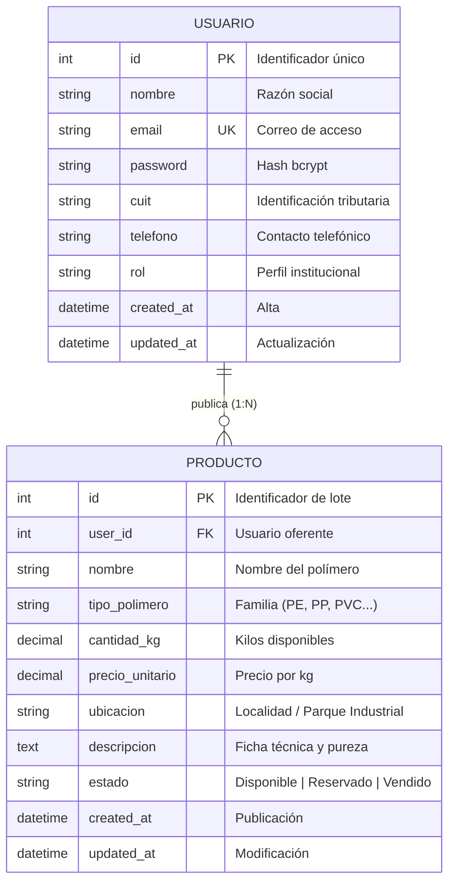

# Hito 1 — Diagrama Entidad-Relación (DER)
**Instituto Técnico Río Tercero — Curso 6° B**  
**Proyecto:** MateriaX — Red Industrial de Reutilización Circular  
**Espacios Curriculares:** Bases de Datos · Laboratorio de Aplicaciones II · Laboratorio de Programación  
**Docentes:** Vanesa Stucher · Francisco Rissone · Simón Zanetti  

---

## 1. Descripción del Sistema y Alcance
MateriaX es una plataforma corporativa que permite a empresas e industrias publicar, gestionar y reutilizar excedentes de polímeros industriales (Polietileno PE, Polipropileno PP, PVC, ABS, Nylon, PET, etc.).

Para el **Hito 1**, el sistema se compone de dos entidades nucleares:
1. **Entidad Principal: USUARIOS**: Representa a las empresas o usuarios registrados que interactúan en la plataforma, gestionan su cuenta e inician sesión de manera autenticada.
2. **Entidad Secundaria: PRODUCTOS (Excedentes de Materiales)**: Representa los lotes de materiales y polímeros industriales dados de alta en el sistema, con su volumen, precio, ubicación geográfica y ficha descriptiva.

---

## 2. Entidades y Atributos

### Entidad: `USUARIO`
- **id** (Numérico, Entero, Clave Primaria - PK): Identificador unívoco del usuario en el sistema.
- **nombre** (Texto, hasta 100 caracteres): Nombre o razón social de la empresa.
- **email** (Texto, hasta 150 caracteres, Único): Dirección de correo corporativo para login.
- **password** (Texto, 255 caracteres): Hash criptográfico seguro (bcrypt) de la clave de acceso.
- **cuit** (Texto, hasta 20 caracteres): CUIT de identificación fiscal de la entidad.
- **telefono** (Texto, hasta 30 caracteres): Línea o celular institucional de contacto.
- **rubro** (Texto, hasta 100 caracteres): Sector o rubro productivo (Inyección, Extrusión, Reciclado, etc.).
- **ciudad** (Texto, hasta 100 caracteres): Ciudad o localidad de radicación.
- **provincia** (Texto, hasta 100 caracteres): Provincia.
- **direccion** (Texto, hasta 150 caracteres): Domicilio de planta o sede fiscal.
- **rol** (Texto, hasta 50 caracteres): Perfil de usuario (por defecto: `'empresa'`).
- **estado** (Texto / Dominio: `pendiente`, `activo`, `inactivo`, `rechazado`): Estado operativo y de auditoría de la cuenta empresarial.
- **created_at** (Fecha y Hora): Fecha y hora en que se registró la cuenta.
- **updated_at** (Fecha y Hora): Última fecha de modificación del perfil.
- **ultimo_login** (Fecha y Hora): Fecha y hora del último acceso exitoso.

### Entidad: `PRODUCTO` (Lote de Material)
- **id** (Numérico, Entero, Clave Primaria - PK): Identificador unívoco del producto/lote publicado.
- **user_id** (Numérico, Entero, Clave Foránea - FK): Identificador del usuario que publica el material.
- **nombre** (Texto, hasta 150 caracteres): Título o denominación del material (ej. *Pellet HDPE Virgen Recuperado*).
- **tipo_polimero** (Texto, hasta 50 caracteres): Categoría técnica del polímero (ej. *Polietileno (PE)*, *Polipropileno (PP)*, *PVC*, etc.).
- **cantidad_kg** (Numérico Decimal): Volumen en kilogramos del lote disponible.
- **precio_unitario** (Numérico Decimal): Precio por kilogramo en moneda de curso legal.
- **ubicacion** (Texto, hasta 100 caracteres): Localidad, parque industrial o planta física de origen.
- **descripcion** (Texto enriquecido/largo): Especificaciones técnicas, color, pureza, malla de molienda o proceso de origen.
- **estado** (Texto / Dominio: `Disponible`, `Reservado`, `Vendido`): Situación comercial del lote.
- **created_at** (Fecha y Hora): Marca temporal de creación de la publicación.
- **updated_at** (Fecha y Hora): Marca temporal de última edición.

---

## 3. Relaciones y Cardinalidad

### Relación: `PUBLICAR` (Usuario publica Productos)
- **Entidad origen:** `USUARIO`
- **Entidad destino:** `PRODUCTO`
- **Cardinalidad:**
  - Un **Usuario** puede publicar **cero, uno o muchos (0..N)** productos.
  - Un **Producto** pertenece de forma obligatoria a **un y sólo un (1..1)** usuario.
- **Tipo de relación:** **1 a N** (Uno a Muchos).
- **Regla de integridad referencial:** En caso de borrado del usuario (`ON DELETE CASCADE`), se eliminan sus publicaciones asociadas, manteniendo la consistencia de la base de datos.

---

## 4. Diagrama Visual (Notación Chen / Patrón Entidad-Relación)

---

## 5. Archivo Draw.io Oficial Multi-Pestaña
El archivo [`docs/DER_drawio.xml`](file:///c:/xampp/htdocs/MateriaxPro/docs/DER_drawio.xml) contiene **2 páginas completas** listas para visualizar y editar en [Draw.io / diagrams.net](https://app.diagrams.net):

1. **Pestaña 1: "1. DER (Entidad-Relación)"**: Diagrama Conceptual completo en notación Chen con entidades (`USUARIO`, `PRODUCTO`, `CATEGORIA_POLIMERO`), relaciones (`PUBLICA`, `CLASIFICA`), elipses de atributos, claves primarias subrayadas y cardinalidades mínimas/máximas `(1,1)` y `(0,N)`.
2. **Pestaña 2: "2. Modelo Relacional (Tablas)"**: Diagrama Lógico/Físico de tablas con tipos de datos de MySQL (`INT`, `VARCHAR`, `DECIMAL`, `ENUM`), campos obligatorios, claves primarias (`PK`), claves foráneas (`FK`) y conectores relacionales de pata de gallo (*Crow's Foot* `1:N`) con regla `ON DELETE CASCADE`.

### Cómo abrirlo en Draw.io:
1. Ingresar a https://app.diagrams.net
2. Seleccionar **Archivo > Abrir desde > Dispositivo**
3. Cargar el archivo `docs/DER_drawio.xml`.
4. En la parte inferior de Draw.io, cambiar entre las pestañas **1. DER** y **2. Modelo Relacional**.
