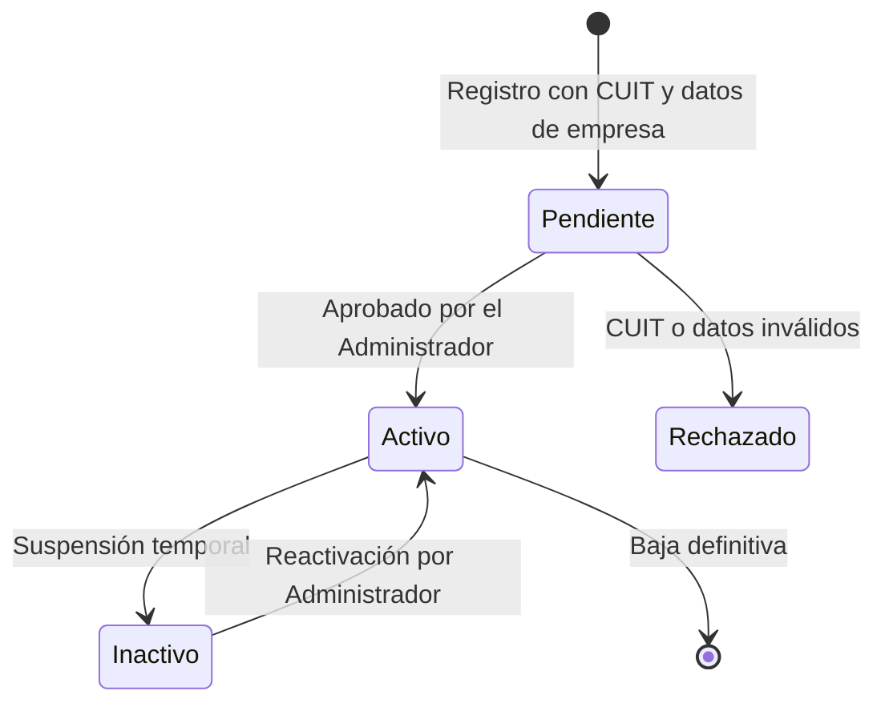
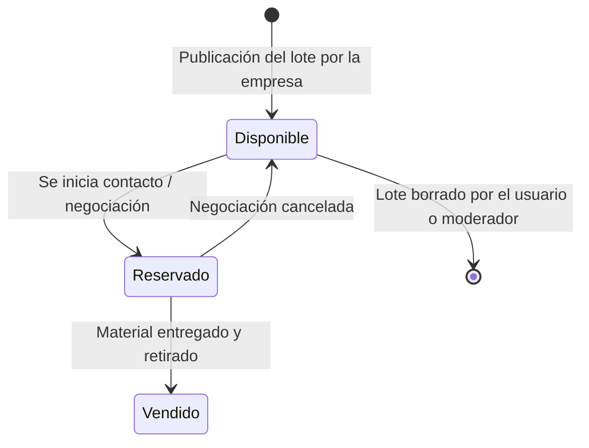
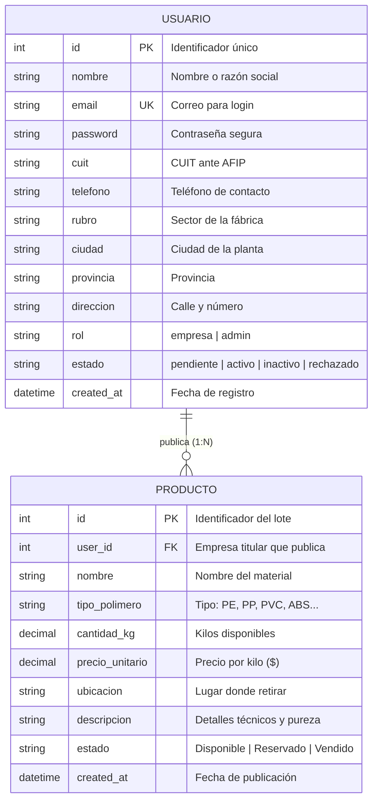

# Diagrama Entidad-Relación (DER) — MateriaX Pro
**Instituto Técnico Río Tercero — 6° Año "B"**  
**Materia:** Bases de Datos · Laboratorio de Aplicaciones II · Laboratorio de Programación  
**Proyecto:** MateriaX Pro — Plataforma de Economía Circular de Polímeros Industriales  
**Alumnos:** 6° B  

---

## 1. Introducción y Propósito del Sistema

**MateriaX Pro** es una plataforma web desarrollada para conectar a industrias y fábricas de la región, facilitando la compra, venta y reutilización de excedentes de materiales plásticos y polímeros (scrap, descartes limpios, moliendas y pellets de PP, PE, PVC, etc.).

El objetivo es impulsar la **economía circular**: que el residuo o sobrante de una fábrica se convierta en la materia prima de otra, evitando que termine en basurales y reduciendo costos industriales.

---

## 2. Entidades del Sistema

El modelo conceptual del proyecto se basa en dos entidades principales bien diferenciadas:

```
┌───────────────────────────────┐           (1,N)           ┌───────────────────────────────┐
│            USUARIO            │ ◄───────────────────────► │           PRODUCTO            │
│      (Empresa Registrada)     │          PUBLICA          │      (Lote de Polímero)       │
└───────────────────────────────┘                           └───────────────────────────────┘
```

### A. Entidad `USUARIO` (Empresas Participantes)
Representa a las empresas, fábricas y recicladoras registradas en la plataforma.
* **Tipo:** Entidad Regular (Fuerte), porque existe por sí misma en el sistema.
* **Identificador Único (PK):** `id` (número asignado automáticamente a cada empresa).
* **Identificador Alternativo (UK):** `email` (correo de acceso único para cada cuenta).

### B. Entidad `PRODUCTO` (Lotes de Materiales)
Representa los lotes físicos de polímeros que las empresas publican para vender o transferir.
* **Tipo:** Entidad Débil por Existencia, porque un lote de material no puede existir en la plataforma sin una empresa titular responsable que lo publique (`user_id`).
* **Identificador Único (PK):** `id` (número asignado a cada lote).
* **Clave Foránea (FK):** `user_id` (hace referencia a la empresa dueña del lote).

---

## 3. Separación de Roles: ¿Por qué el Usuario no puede ser Administrador?

En nuestro diseño, **un usuario común (empresa) NO puede ser administrador**, sin importar si tiene la sesión iniciada o no. 

Esto se debe a que sus roles y permisos son totalmente diferentes:

1. **Usuario No Logeado (Visitante):**
   * Puede ver la portada de la web y la explicación del proyecto.
   * Puede acceder al formulario de login o registrar su empresa.
   * **No puede** ver los lotes de materiales, ni publicar, ni acceder a paneles.

2. **Usuario Logeado (Empresa):**
   * Puede explorar el mercado de polímeros disponibles.
   * Puede publicar sus propios lotes de materiales.
   * Puede ver su panel privado con sus estadísticas (`/panel`).
   * Puede editar y borrar **únicamente sus propios productos**.
   * **Nunca puede ser administrador**: el formulario de registro le asigna rol `'empresa'`, el perfil no permite cambiar el rol y no tiene acceso a ninguna función de auditoría.

3. **Administrador del Sistema:**
   * Es una cuenta especial de control y supervisión (`/admin`).
   * Audita las empresas nuevas: revisa su CUIT y datos para **aprobarlas o rechazarlas**.
   * Puede suspender cuentas inactivas o con irregularidades.
   * Puede moderar o dar de baja publicaciones que no cumplan las normas técnicas.

---

## 4. Atributos de Cada Entidad

### Atributos de `USUARIO`
* **`id`** (Numérico, Clave Primaria): Número único de la empresa.
* **`nombre`** (Texto): Razón social o nombre legal de la fábrica.
* **`email`** (Texto, Único): Correo corporativo de acceso.
* **`password`** (Texto): Contraseña encriptada para seguridad.
* **`cuit`** (Texto): Identificación tributaria ante AFIP (ej: 30-XXXXXXXX-X).
* **`telefono`** (Texto): Teléfono de contacto de planta.
* **`rubro`** (Texto): Sector de la empresa (Inyección, Extrusión, Reciclado, etc.).
* **`ciudad`**, **`provincia`**, **`direccion`** (Textos): Domicilio de la planta, descompuesto en campos atómicos para cumplir con la Primera Forma Normal (1FN).
* **`rol`** (Texto): Rol asignado (`'empresa'` para usuarios comunes, `'admin'` para auditoría).
* **`estado`** (Enum): Estado de la cuenta (`'pendiente'`, `'activo'`, `'inactivo'`, `'rechazado'`).
* **`created_at`**, **`updated_at`**, **`ultimo_login`** (Fechas): Fechas de auditoría y último acceso.

### Atributos de `PRODUCTO`
* **`id`** (Numérico, Clave Primaria): Número único del lote.
* **`user_id`** (Numérico, Clave Foránea): ID de la empresa dueña del lote.
* **`nombre`** (Texto): Nombre del material (ej: "Molienda de Polietileno Alta Densidad").
* **`tipo_polimero`** (Texto): Sigla de la resina (`PE`, `PP`, `PVC`, `ABS`, `PET`, etc.).
* **`cantidad_kg`** (Decimal): Cantidad en kilogramos disponible.
* **`precio_unitario`** (Decimal): Precio por kilo en pesos argentinos ($ ARS).
* **`valor_total`** (Calculado / Derivado): Se calcula multiplicando `cantidad_kg * precio_unitario` (no hace falta guardarlo en la base de datos).
* **`ubicacion`** (Texto): Ciudad o parque industrial donde retirar el material.
* **`descripcion`** (Texto): Detalles de pureza, color, malla o estado del plástico.
* **`estado`** (Enum): Disponibilidad comercial (`'Disponible'`, `'Reservado'`, `'Vendido'`).
* **`created_at`**, **`updated_at`** (Fechas): Fechas de publicación y modificación.

---

## 5. Relación y Cardinalidades

### Vínculo: `PUBLICA`
Conecta a la entidad `USUARIO` con la entidad `PRODUCTO`.

* **De `USUARIO` a `PRODUCTO` $\to$ `(0, N)`:**
  Una empresa que se registra puede no haber publicado ningún producto todavía (mínimo 0), o puede publicar muchos lotes a lo largo del tiempo (máximo N).
* **De `PRODUCTO` a `USUARIO` $\to$ `(1, 1)`:**
  Cada lote publicado pertenece de manera estricta y obligatoria a una sola empresa (mínimo 1, máximo 1). No puede haber publicaciones sin empresa dueña.
* **Tipo de Relación:** **1 a N (Uno a Muchos)**.
* **Regla al Eliminar (`ON DELETE CASCADE`):** Si una empresa es eliminada definitivamente, se borran automáticamente sus publicaciones para no dejar lotes abandonados.

---

## 6. Diagramas de Estados (Ciclo de Vida)

### Ciclo de Vida de la Cuenta de Usuario

```mermaid
stateDiagram-v2
    [*] --> Pendiente : Registro con CUIT y datos de empresa
    Pendiente --> Activo : Aprobado por el Administrador
    Pendiente --> Rechazado : CUIT o datos inválidos
    Activo --> Inactivo : Suspensión temporal
    Inactivo --> Activo : Reactivación por Administrador
    Activo --> [*] : Baja definitiva
```

### Ciclo de Vida del Lote de Material

```mermaid
stateDiagram-v2
    [*] --> Disponible : Publicación del lote por la empresa
    Disponible --> Reservado : Se inicia contacto / negociación
    Reservado --> Disponible : Negociación cancelada
    Reservado --> Vendido : Material entregado y retirado
    Disponible --> [*] : Lote borrado por el usuario o moderador
```

---

## 7. Diagrama Entidad-Relación Visual (Mermaid)


```mermaid
erDiagram
    USUARIO ||--o{ PRODUCTO : "publica (1:N)"

    USUARIO {
        int id PK "Identificador único"
        string nombre "Nombre o razón social"
        string email UK "Correo para login"
        string password "Contraseña segura"
        string cuit "CUIT ante AFIP"
        string telefono "Teléfono de contacto"
        string rubro "Sector de la fábrica"
        string ciudad "Ciudad de la planta"
        string provincia "Provincia"
        string direccion "Calle y número"
        string rol "empresa | admin"
        string estado "pendiente | activo | inactivo | rechazado"
        datetime created_at "Fecha de registro"
    }

    PRODUCTO {
        int id PK "Identificador del lote"
        int user_id FK "Empresa titular que publica"
        string nombre "Nombre del material"
        string tipo_polimero "Tipo: PE, PP, PVC, ABS..."
        decimal cantidad_kg "Kilos disponibles"
        decimal precio_unitario "Precio por kilo ($)"
        string ubicacion "Lugar donde retirar"
        string descripcion "Detalles técnicos y pureza"
        string estado "Disponible | Reservado | Vendido"
        datetime created_at "Fecha de publicación"
    }
```
