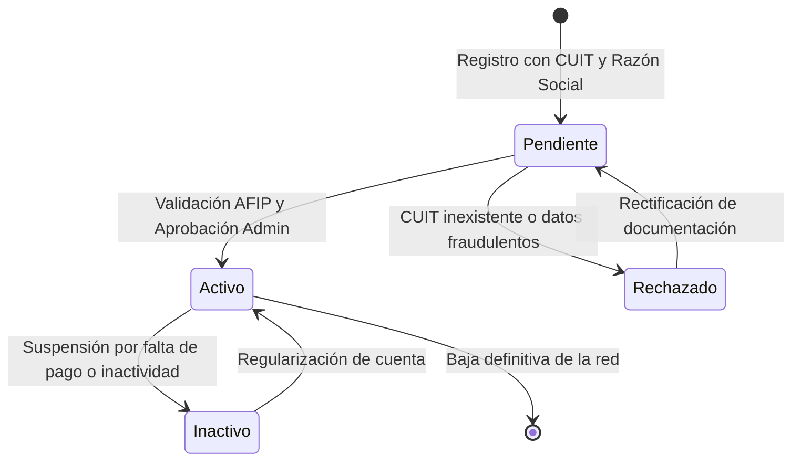
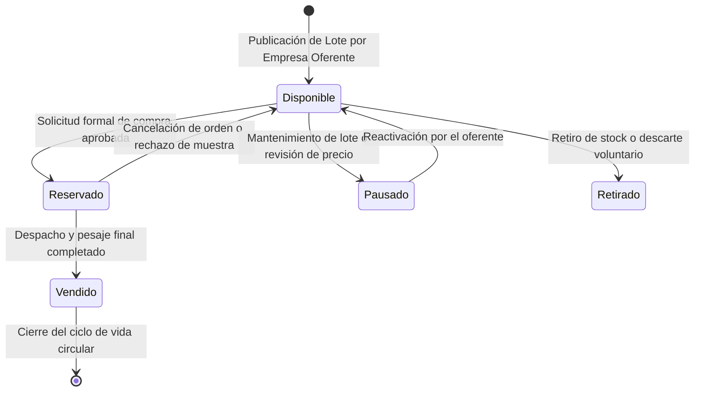
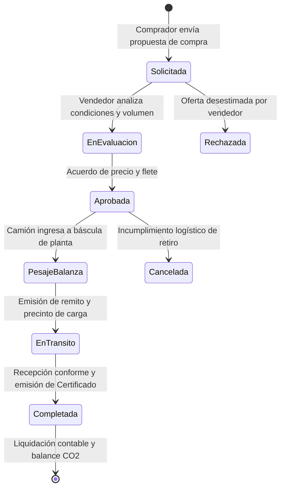
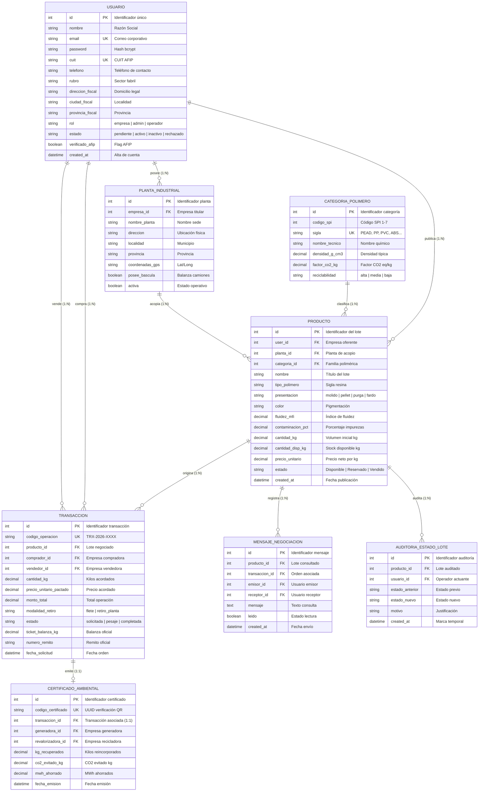

# MateriaX Pro — Diagrama Entidad-Relación Conceptual (DER)
**Red Industrial de Reutilización Circular y Simbiosis de Polímeros**  
**Instituto Técnico Río Tercero — Curso 6° B**  
**Espacios Curriculares:** Bases de Datos · Laboratorio de Aplicaciones II · Laboratorio de Programación  
**Docentes:** Vanesa Stucher · Francisco Rissone · Simón Zanetti  

---

## 1. Contexto de Negocio, Dominio y Simbiosis Industrial

**MateriaX Pro** es una plataforma tecnológica B2B concebida para digitalizar la **economía circular** y la **simbiosis industrial** en el polo manufacturero de la provincia de Córdoba y la región centro de la República Argentina. Su propósito primordial es transformar mermas de proceso, descartes limpios, tortas de purga, granzas y excedentes de stock de polímeros industriales en materias primas secundarias certificadas, reincorporándolas en nuevas cadenas de valor fabril.

Para que el sistema sea **real, operativo y funcional**, el modelo de datos trasciende una simple cartelera estática y estructura el ciclo de vida completo de la economía circular:
1. **Homologación Fiscal y Seguridad Jurídica:** Validación de personería jurídica de las plantas (CUIT validado ante AFIP), auditoría de empresas y control estricto de roles (`empresa`, `admin`, `operador`).
2. **Infraestructura y Logística Descentralizada:** Soporte para múltiples plantas fabriles y centros de acopio por empresa, registrando pesaje en báscula industrial de camiones y coordenadas geográficas.
3. **Catálogo Técnico Internacional (Norma SPI / ASTM D7611):** Clasificación normalizada de resinas (PET, PEAD, PVC, PEBD, PP, PS, ABS, PA, etc.), con propiedades reológicas (Índice de Fluidez MFI), pureza, color y factor de reducción de huella de carbono.
4. **Circuito Comercial B2B Transaccional:** Solicitudes formales de adquisición, negociación de precios, control dinámico de stock remanente, documentación de despacho (remitos) y seguimiento logístico.
5. **Certificación y Balance de Impacto Ambiental:** Emisión de certificados de trazabilidad ambiental con código QR único, calculando masa recuperada (kg), emisiones evitadas de $CO_2$ ($kg\text{ }CO_{2}\text{eq}$) y ahorro energético ($MWh$).
6. **Auditoría e Inmutabilidad de Estados:** Registro histórico de eventos y cambios de estado sobre los lotes para cumplimiento de normativas ambientales (ISO 14001, OPDS y Secretaría de Ambiente).

---

## 2. Taxonomía y Clasificación Semántica de Entidades

El modelo conceptual está estructurado en 4 módulos integrados y 8 entidades principales:

```
┌────────────────────────────────────────────────────────────────────────────────────────────────────────┐
│                                ARQUITECTURA MODULAR DE MATERIAX PRO                                    │
├──────────────────────────────┬──────────────────────────────┬──────────────────────────────────────────┤
│ Módulo A: Identidad & Sedes  │ Módulo B: Catálogo & Lotes   │ Módulo C: Transacciones & Trazabilidad   │
├──────────────────────────────┼──────────────────────────────┼──────────────────────────────────────────┤
│ • USUARIO (Fuerte)           │ • CATEGORIA_POLIMERO (Fuerte)│ • TRANSACCION (Asociativa / Transaccional│
│ • PLANTA_INDUSTRIAL (Débil)  │ • PRODUCTO (Débil por exist.)│ • MENSAJE_NEGOCIACION (Débil)            │
│                              │                              │ • CERTIFICADO_AMBIENTAL (Subordinada)    │
│                              │                              │ • AUDITORIA_ESTADO_LOTE (Histórica)      │
└──────────────────────────────┴──────────────────────────────┴──────────────────────────────────────────┘
```

### A. Entidades Fuertes (Regulares / Autónomas)
1. **`USUARIO`:** Representa a la persona jurídica (empresa transformadora, generadora, recicladora) o al administrador institucional. Posee existencia propia e independiente en el universo del discurso.
   * *Clave Primaria (PK):* `id`
   * *Clave Alternativa / Candidata (UK):* `email`, `cuit`
2. **`CATEGORIA_POLIMERO`:** Catálogo maestro estandarizado de familias poliméricas bajo norma SPI / ASTM D7611.
   * *Clave Primaria (PK):* `id`
   * *Clave Alternativa / Candidata (UK):* `sigla` (ej: `'PP'`, `'HDPE'`, `'ABS'`)

### B. Entidades Débiles por Existencia
3. **`PLANTA_INDUSTRIAL`:** Sedes fabriles y depósitos operativos donde se ubica físicamente el material. Depende existencialmente de `USUARIO` (no puede existir una planta sin una empresa titular).
   * *Clave Primaria (PK):* `id`
   * *Clave Foránea (FK):* `empresa_id` $\to$ `USUARIO(id)`
4. **`PRODUCTO` (Lote de Material):** Lote de excedente o scrap polimérico publicado para su reutilización. Depende existencialmente de `USUARIO` (empresa oferente titular) y de `CATEGORIA_POLIMERO` (familia química).
   * *Clave Primaria (PK):* `id`
   * *Claves Foráneas (FK):* `user_id` $\to$ `USUARIO(id)`, `planta_id` $\to$ `PLANTA_INDUSTRIAL(id)`, `categoria_id` $\to$ `CATEGORIA_POLIMERO(id)`
5. **`MENSAJE_NEGOCIACION`:** Mensajería y consultas técnicas B2B vinculadas a un lote o transacción.
   * *Clave Primaria (PK):* `id`
   * *Claves Foráneas (FK):* `producto_id`, `emisor_id`, `receptor_id`, `transaccion_id`
6. **`AUDITORIA_ESTADO_LOTE`:** Registro cronológico de cambios de estado del lote para fiscalización.
   * *Clave Primaria (PK):* `id`
   * *Claves Foráneas (FK):* `producto_id`, `usuario_id`

### C. Entidades Asociativas / Transaccionales
7. **`TRANSACCION`:** Modela el acuerdo de intercambio comercial entre una empresa compradora y una vendedora por una cantidad específica de un lote. Conecta `PRODUCTO`, `USUARIO` (comprador) y `USUARIO` (vendedor).
   * *Clave Primaria (PK):* `id`
   * *Clave Candidata (UK):* `codigo_operacion` (ej: `'TRX-2026-0001'`)
   * *Claves Foráneas (FK):* `producto_id`, `comprador_id`, `vendedor_id`, `planta_origen_id`
8. **`CERTIFICADO_AMBIENTAL`:** Documento legal de disposición sustentable emitido tras la concreción de una transacción. Subordinada 1:1 con `TRANSACCION`.
   * *Clave Primaria (PK):* `id`
   * *Clave Candidata (UK):* `codigo_certificado` (UUID criptográfico)
   * *Clave Foránea (FK):* `transaccion_id` (1:1), `empresa_generadora_id`, `empresa_revalorizadora_id`

---

## 3. Taxonomía Exhaustiva de Atributos

### 3.1. Entidad `USUARIO` (Empresas y Operadores)
| Atributo | Tipo Conceptual | Clasificación | Dominio / Restricción | Propósito en el Negocio |
| :--- | :--- | :--- | :--- | :--- |
| **id** | Entero Positivo | Identificador (PK) | Auto-incremental | Identificador único de usuario. |
| **nombre** | Alfanumérico (120) | Simple, Obligatorio | No nulo | Razón social o denominación legal. |
| **email** | Alfanumérico (150) | Simple, Único (UK) | Email válido | Credencial única de acceso. |
| **password** | Alfanumérico (255) | Simple, Obligatorio | Hash bcrypt seguro | Clave cifrada de autenticación. |
| **cuit** | Alfanumérico (20) | Simple, Único (UK) | Formato `30-XXXXXXXX-X` | Clave fiscal de validación AFIP. |
| **telefono** | Alfanumérico (30) | Simple, Obligatorio | Min 6 dígitos | Contacto telefónico institucional. |
| **rubro** | Alfanumérico (100) | Simple, Opcional | Inyección, Extrusión, Reciclado | Sector productivo fabril. |
| **direccion_fiscal**| Alfanumérico (150) | Componente atómico | Calle y número | Domicilio legal para facturación. |
| **ciudad_fiscal** | Alfanumérico (100) | Componente atómico | Ciudad de radicación | Localidad de la sede fiscal. |
| **provincia_fiscal**| Alfanumérico (100)| Componente atómico | Jurisdicción provincial | Provincia fiscal. |
| **rol** | Enum | Simple, Obligatorio | `'empresa'`, `'admin'`, `'operador'` | Perfil y nivel de autorización. |
| **estado** | Enum | Simple, Obligatorio | `'pendiente'`, `'activo'`, `'inactivo'`, `'rechazado'` | Estado de auditoría institucional. |
| **verificado_afip** | Booleano | Simple, Obligatorio | `0` (No), `1` (Sí) | Flag de validación de personería. |
| **created_at** | Marca Temporal | Auditoría | Fecha y hora de alta | Momento de registro. |
| **updated_at** | Marca Temporal | Auditoría | Fecha y hora de edición | Última modificación. |
| **ultimo_login**| Marca Temporal | Auditoría | Fecha y hora nula/válida | Último ingreso autenticado. |

### 3.2. Entidad `PLANTA_INDUSTRIAL` (Sedes Operativas)
| Atributo | Tipo Conceptual | Clasificación | Dominio / Restricción | Propósito en el Negocio |
| :--- | :--- | :--- | :--- | :--- |
| **id** | Entero Positivo | Identificador (PK) | Auto-incremental | Identificador de la planta. |
| **empresa_id** | Entero Positivo | Foránea (FK) | `USUARIO(id)` | Empresa propietaria de la planta. |
| **nombre_planta**| Alfanumérico (100) | Simple, Obligatorio | Ej: "Planta Parque Ind. Río Tercero" | Denominación del predio fabril. |
| **direccion** | Alfanumérico (150) | Componente atómico | Calle, ruta o parque ind. | Domicilio físico de retiro/entrega. |
| **localidad** | Alfanumérico (100) | Componente atómico | Localidad | Municipio o comuna del predio. |
| **provincia** | Alfanumérico (100) | Componente atómico | Provincia | Jurisdicción territorial. |
| **coordenadas_gps**| Alfanumérico (50) | Simple, Opcional | `lat,long` | Ubicación geográfica para fletes. |
| **posee_bascula**| Booleano | Simple, Obligatorio | `1` = Sí, `0` = No | Disponibilidad de balanza de camiones.|
| **activa** | Booleano | Simple, Obligatorio | `1` = Activa, `0` = Inactiva | Estado operativo de la sede. |

### 3.3. Entidad `CATEGORIA_POLIMERO` (Catálogo SPI / ASTM D7611)
| Atributo | Tipo Conceptual | Clasificación | Dominio / Restricción | Propósito en el Negocio |
| :--- | :--- | :--- | :--- | :--- |
| **id** | Entero Positivo | Identificador (PK) | Auto-incremental | Identificador de la resina. |
| **codigo_spi** | Entero (1 a 7) | Simple, Obligatorio | Código SPI 1 a 7 | Símbolo estándar de identificación. |
| **sigla** | Alfanumérico (10) | Simple, Único (UK) | `PEAD`, `PEBD`, `PP`, `PVC`, `PET`, `PS`, `ABS`, `PA` | Abreviatura técnica internacional. |
| **nombre_tecnico**| Alfanumérico (100) | Simple, Obligatorio | Texto técnico | Nombre químico completo de la resina. |
| **densidad_g_cm3**| Decimal (4,3) | Simple, Obligatorio | $0.800$ a $1.600\text{ g/cm}^3$ | Peso específico de referencia. |
| **temp_fusion_c** | Entero | Simple, Opcional | Temperatura en °C | Punto de fusión térmico. |
| **factor_co2_kg** | Decimal (5,2) | Simple, Obligatorio | Factor numérico $> 0$ | $kg\text{ }CO_2\text{eq}$ evitados por kg reciclado. |
| **reciclabilidad**| Enum | Simple, Obligatorio | `'alta'`, `'media'`, `'baja'`, `'especial'` | Grado de facilidad de reproceso. |

### 3.4. Entidad `PRODUCTO` (Lote de Material Ofertado)
| Atributo | Tipo Conceptual | Clasificación | Dominio / Restricción | Propósito en el Negocio |
| :--- | :--- | :--- | :--- | :--- |
| **id** | Entero Positivo | Identificador (PK) | Auto-incremental | Identificador único del lote. |
| **user_id** | Entero Positivo | Foránea (FK) | `USUARIO(id)` | Empresa titular vendedora. |
| **planta_id** | Entero Positivo | Foránea (FK) | `PLANTA_INDUSTRIAL(id)` | Planta física donde acopia el lote. |
| **categoria_id** | Entero Positivo | Foránea (FK) | `CATEGORIA_POLIMERO(id)` | Familia polimérica clasificada. |
| **nombre** | Alfanumérico (150) | Simple, Obligatorio | Texto descriptivo | Título técnico de la publicación. |
| **tipo_polimero**| Alfanumérico (50) | Simple, Obligatorio | Redundancia controlada | Búsquedas rápidas indexadas. |
| **presentacion** | Enum | Simple, Obligatorio | `'scrap_molido'`, `'pellet_regranulado'`, `'purga_torta'`, `'film_fardos'`, `'descarte_piezas'` | Estado físico y forma del material. |
| **color** | Alfanumérico (50) | Simple, Obligatorio | Negro, Cristal, Blanco, etc. | Pigmentación del polímero. |
| **fluidez_mfi** | Decimal (6,2) | Simple, Opcional | $g/10\text{ min}$ a $230^\circ\text{C}$ | Índice de fluidez en masa. |
| **contaminacion_pct**| Decimal (5,2) | Simple, Obligatorio | $0.00\%$ a $100.00\%$ | Nivel de impurezas no plásticas. |
| **cantidad_kg** | Decimal (10,2) | Simple, Obligatorio | Valor $> 0$ | Kilogramos iniciales publicados. |
| **cantidad_disp_kg**| Decimal (10,2) | Simple, Obligatorio | $0 \le \text{disp} \le \text{total}$ | Stock remanente en tiempo real. |
| **pedido_minimo_kg**| Decimal (10,2) | Simple, Obligatorio | Valor $\le \text{cantidad\_kg}$ | Volumen mínimo de venta. |
| **precio_unitario**| Decimal (10,2) | Simple, Obligatorio | Valor $\ge 0$ ($ ARS/kg) | Precio neto por kilogramo. |
| **valor_total_lote**| Decimal (12,2) | **Derivado (Calculado)** | $\text{cantidad\_kg} \times \text{precio\_unitario}$ | Valor económico total estimado. |
| **moneda** | Enum | Simple, Obligatorio | `'ARS'`, `'USD'` | Moneda de comercialización. |
| **acondicionamiento**| Alfanumérico (100)| Simple, Opcional | Big Bags, Fardos, Octavines | Embalaje de entrega del lote. |
| **estado** | Enum | Simple, Obligatorio | `'Disponible'`, `'Reservado'`, `'Vendido'`, `'Pausado'`, `'Retirado'` | Disponibilidad comercial del lote. |
| **created_at** | Marca Temporal | Auditoría | Fecha y hora | Alta en plataforma. |
| **updated_at** | Marca Temporal | Auditoría | Fecha y hora | Modificación de stock o precio. |

### 3.5. Entidad `TRANSACCION` (Operaciones Comerciales B2B)
| Atributo | Tipo Conceptual | Clasificación | Dominio / Restricción | Propósito en el Negocio |
| :--- | :--- | :--- | :--- | :--- |
| **id** | Entero Positivo | Identificador (PK) | Auto-incremental | Identificador de la transacción. |
| **codigo_operacion**| Alfanumérico (20) | Simple, Único (UK) | Ej: `'TRX-2026-0084'` | Código alfanumérico visible de orden. |
| **producto_id** | Entero Positivo | Foránea (FK) | `PRODUCTO(id)` | Lote objeto de la operación. |
| **comprador_id**| Entero Positivo | Foránea (FK) | `USUARIO(id)` | Empresa que adquiere el material. |
| **vendedor_id** | Entero Positivo | Foránea (FK) | `USUARIO(id)` | Empresa que despacha el material. |
| **planta_origen_id**| Entero Positivo | Foránea (FK) | `PLANTA_INDUSTRIAL(id)` | Predio desde donde sale la carga. |
| **cantidad_kg** | Decimal (10,2) | Simple, Obligatorio | Valor $> 0$ | Kilos pactados en la transacción. |
| **precio_unitario_pactado**| Decimal (10,2) | Simple, Obligatorio | Valor $\ge 0$ | Precio acordado por kg. |
| **subtotal** | Decimal (12,2) | Simple, Obligatorio | $\text{cantidad} \times \text{precio\_unitario}$ | Monto neto de materiales. |
| **costo_flete** | Decimal (10,2) | Simple, Opcional | Valor $\ge 0$ | Costo de transporte si aplica. |
| **monto_total** | Decimal (12,2) | Simple, Obligatorio | $\text{subtotal} + \text{costo\_flete}$ | Valor total de la operación. |
| **modalidad_retiro**| Enum | Simple, Obligatorio | `'retiro_comprador'`, `'entrega_vendedor'`, `'flete_convenido'` | Logística pactada. |
| **estado** | Enum | Simple, Obligatorio | `'solicitada'`, `'en_evaluacion'`, `'aprobada'`, `'pesaje_balanza'`, `'en_transito'`, `'completada'`, `'rechazada'`, `'cancelada'` | Estado del flujo transaccional. |
| **ticket_balanza_kg**| Decimal (10,2)| Simple, Opcional | Valor balanza oficial | Kilos netos verificados en báscula. |
| **numero_remito**| Alfanumérico (50)| Simple, Opcional | Documento oficial | Número de remito fiscal de traslado. |
| **fecha_solicitud**| Marca Temporal| Auditoría | Fecha y hora | Apertura de la solicitud. |
| **fecha_acuerdo**| Marca Temporal | Auditoría | Fecha y hora nula/válida | Momento de aceptación mutua. |
| **fecha_despacho**| Marca Temporal| Auditoría | Fecha y hora nula/válida | Salida de planta del camión. |
| **fecha_cierre** | Marca Temporal | Auditoría | Fecha y hora nula/válida | Conformidad y recepción final. |

### 3.6. Entidad `CERTIFICADO_AMBIENTAL` (Impacto y Trazabilidad Circular)
| Atributo | Tipo Conceptual | Clasificación | Dominio / Restricción | Propósito en el Negocio |
| :--- | :--- | :--- | :--- | :--- |
| **id** | Entero Positivo | Identificador (PK) | Auto-incremental | Identificador del certificado. |
| **codigo_certificado**| Alfanumérico (40)| Simple, Único (UK) | UUID criptográfico | Hash para validación pública por QR. |
| **transaccion_id**| Entero Positivo | Foránea (FK, UK) | `TRANSACCION(id)` | Vínculo biunívoco 1:1 con la transacción.|
| **generadora_id**| Entero Positivo | Foránea (FK) | `USUARIO(id)` | Empresa que desvió el descarte. |
| **revalorizadora_id**| Entero Positivo| Foránea (FK) | `USUARIO(id)` | Empresa que reincorporó el material. |
| **kg_recuperados**| Decimal (10,2) | Simple, Obligatorio | Valor $> 0$ | Masa neta reincorporada en kg. |
| **co2_evitado_kg**| Decimal (10,2) | Simple, Obligatorio | $\text{kg} \times \text{factor\_co2}$ | Emisiones de gases invernadero evitadas.|
| **mwh_ahorrado** | Decimal (8,2) | Simple, Obligatorio | Valor $> 0$ | Energía térmica/eléctrica preservada. |
| **fecha_emision**| Marca Temporal | Auditoría | Fecha y hora | Momento de certificación digital. |

### 3.7. Entidad `MENSAJE_NEGOCIACION` (Consultas Técnicas B2B)
| Atributo | Tipo Conceptual | Clasificación | Dominio / Restricción | Propósito en el Negocio |
| :--- | :--- | :--- | :--- | :--- |
| **id** | Entero Positivo | Identificador (PK) | Auto-incremental | Identificador del mensaje. |
| **producto_id** | Entero Positivo | Foránea (FK) | `PRODUCTO(id)` | Lote consultado. |
| **transaccion_id**| Entero Positivo| Foránea (FK, Opc.)| `TRANSACCION(id)` | Hilo de orden específica (opcional). |
| **emisor_id** | Entero Positivo | Foránea (FK) | `USUARIO(id)` | Usuario remitente. |
| **receptor_id** | Entero Positivo | Foránea (FK) | `USUARIO(id)` | Usuario destinatario. |
| **mensaje** | Texto Largo | Simple, Obligatorio | Texto libre | Contenido técnico o propuesta. |
| **leido** | Booleano | Simple, Obligatorio | `0` = No, `1` = Sí | Confirmación de lectura. |
| **created_at** | Marca Temporal | Auditoría | Fecha y hora | Registro de envío. |

### 3.8. Entidad `AUDITORIA_ESTADO_LOTE` (Trazabilidad y Log de Eventos)
| Atributo | Tipo Conceptual | Clasificación | Dominio / Restricción | Propósito en el Negocio |
| :--- | :--- | :--- | :--- | :--- |
| **id** | Entero Positivo | Identificador (PK) | Auto-incremental | Identificador del log. |
| **producto_id** | Entero Positivo | Foránea (FK) | `PRODUCTO(id)` | Lote afectado. |
| **usuario_id** | Entero Positivo | Foránea (FK) | `USUARIO(id)` | Operador responsable del cambio. |
| **estado_anterior**| Alfanumérico (30)| Simple, Obligatorio | Estado previo | Estado antes de la mutación. |
| **estado_nuevo**| Alfanumérico (30)| Simple, Obligatorio | Estado posterior | Nuevo estado aplicado. |
| **motivo** | Alfanumérico (255)| Simple, Opcional | Texto descriptivo | Justificación de cambio o rechazo. |
| **ip_address** | Alfanumérico (45) | Simple, Opcional | IPv4 / IPv6 | Dirección IP de auditoría. |
| **created_at** | Marca Temporal | Auditoría | Fecha y hora | Marca temporal del evento. |

---

## 4. Matriz de Relaciones, Conectividad y Cardinalidades

| Relación | Entidad Origen | Entidad Destino | Tipo | Card. Origen | Card. Destino | Semántica de Negocio |
| :--- | :--- | :--- | :---: | :---: | :---: | :--- |
| **RADICADA_EN** | `USUARIO` | `PLANTA_INDUSTRIAL` | 1:N | (1, 1) | (0, N) | Una empresa puede tener 0 o muchas plantas operativas; cada planta pertenece a 1 empresa. |
| **CLASIFICA** | `CATEGORIA_POLIMERO` | `PRODUCTO` | 1:N | (1, 1) | (0, N) | Una categoría clasifica 0 o muchos lotes; cada lote pertenece obligatoriamente a 1 categoría. |
| **ACOPIA_EN** | `PLANTA_INDUSTRIAL` | `PRODUCTO` | 1:N | (0, 1) | (0, N) | Una planta acopia 0 o muchos lotes; un lote se almacena en 1 planta de retiro (o sede general). |
| **PUBLICA** | `USUARIO` | `PRODUCTO` | 1:N | (1, 1) | (0, N) | Una empresa oferente publica 0 o muchos lotes; cada lote pertenece a 1 única empresa titular. |
| **ORIGINA** | `PRODUCTO` | `TRANSACCION` | 1:N | (1, 1) | (0, N) | Un lote puede recibir 0 o varias transacciones (compras parciales); cada orden pertenece a 1 lote. |
| **COMPRA** | `USUARIO` | `TRANSACCION` | 1:N | (1, 1) | (0, N) | Una empresa compradora puede emitir 0 o muchas solicitudes; cada transacción tiene 1 comprador. |
| **VENDE** | `USUARIO` | `TRANSACCION` | 1:N | (1, 1) | (0, N) | Una empresa vendedora recibe 0 o muchas solicitudes; cada transacción tiene 1 vendedor. |
| **CERTIFICA** | `TRANSACCION` | `CERTIFICADO_AMBIENTAL`| 1:1 | (1, 1) | (0, 1) | Una transacción completada emite como máximo 1 certificado ambiental único. |
| **CONSULTA** | `PRODUCTO` | `MENSAJE_NEGOCIACION` | 1:N | (1, 1) | (0, N) | Un producto puede tener 0 o muchos mensajes/consultas técnicas asociadas. |
| **AUDITA** | `PRODUCTO` | `AUDITORIA_ESTADO_LOTE`| 1:N | (1, 1) | (0, N) | Cada lote registra un historial de 0 a N cambios de estado para trazabilidad. |

---

## 5. Diagramas de Ciclo de Vida y Transición de Estados

### 5.1. Ciclo de Vida de la Empresa (`USUARIO`)

```mermaid
stateDiagram-v2
    [*] --> Pendiente : Registro con CUIT y Razón Social
    Pendiente --> Activo : Validación AFIP y Aprobación Admin
    Pendiente --> Rechazado : CUIT inexistente o datos fraudulentos
    Rechazado --> Pendiente : Rectificación de documentación
    Activo --> Inactivo : Suspensión por falta de pago o inactividad
    Inactivo --> Activo : Regularización de cuenta
    Activo --> [*] : Baja definitiva de la red
```

### 5.2. Ciclo de Vida del Lote de Polímero (`PRODUCTO`)

```mermaid
stateDiagram-v2
    [*] --> Disponible : Publicación de Lote por Empresa Oferente
    Disponible --> Reservado : Solicitud formal de compra aprobada
    Reservado --> Disponible : Cancelación de orden o rechazo de muestra
    Reservado --> Vendido : Despacho y pesaje final completado
    Disponible --> Pausado : Mantenimiento de lote o revisión de precio
    Pausado --> Disponible : Reactivación por el oferente
    Disponible --> Retirado : Retiro de stock o descarte voluntario
    Vendido --> [*] : Cierre del ciclo de vida circular
```

### 5.3. Ciclo de Vida de la Transacción B2B (`TRANSACCION`)

```mermaid
stateDiagram-v2
    [*] --> Solicitada : Comprador envía propuesta de compra
    Solicitada --> EnEvaluacion : Vendedor analiza condiciones y volumen
    Solicitada --> Rechazada : Oferta desestimada por vendedor
    EnEvaluacion --> Aprobada : Acuerdo de precio y flete
    Aprobada --> PesajeBalanza : Camión ingresa a báscula de planta
    PesajeBalanza --> EnTransito : Emisión de remito y precinto de carga
    EnTransito --> Completada : Recepción conforme y emisión de Certificado
    Aprobada --> Cancelada : Incumplimiento logístico de retiro
    Completada --> [*] : Liquidación contable y balance CO2
```

---

## 6. Diagrama Entidad-Relación Visual (Mermaid)


```mermaid
erDiagram
    USUARIO ||--o{ PLANTA_INDUSTRIAL : "posee (1:N)"
    USUARIO ||--o{ PRODUCTO : "publica (1:N)"
    CATEGORIA_POLIMERO ||--o{ PRODUCTO : "clasifica (1:N)"
    PLANTA_INDUSTRIAL ||--o{ PRODUCTO : "acopia (1:N)"
    PRODUCTO ||--o{ TRANSACCION : "origina (1:N)"
    USUARIO ||--o{ TRANSACCION : "compra (1:N)"
    USUARIO ||--o{ TRANSACCION : "vende (1:N)"
    TRANSACCION ||--o| CERTIFICADO_AMBIENTAL : "emite (1:1)"
    PRODUCTO ||--o{ MENSAJE_NEGOCIACION : "registra (1:N)"
    PRODUCTO ||--o{ AUDITORIA_ESTADO_LOTE : "audita (1:N)"

    USUARIO {
        int id PK "Identificador único"
        string nombre "Razón Social"
        string email UK "Correo corporativo"
        string password "Hash bcrypt"
        string cuit UK "CUIT AFIP"
        string telefono "Teléfono de contacto"
        string rubro "Sector fabril"
        string direccion_fiscal "Domicilio legal"
        string ciudad_fiscal "Localidad"
        string provincia_fiscal "Provincia"
        string rol "empresa | admin | operador"
        string estado "pendiente | activo | inactivo | rechazado"
        boolean verificado_afip "Flag AFIP"
        datetime created_at "Alta de cuenta"
    }

    PLANTA_INDUSTRIAL {
        int id PK "Identificador planta"
        int empresa_id FK "Empresa titular"
        string nombre_planta "Nombre sede"
        string direccion "Ubicación física"
        string localidad "Municipio"
        string provincia "Provincia"
        string coordenadas_gps "Lat/Long"
        boolean posee_bascula "Balanza camiones"
        boolean activa "Estado operativo"
    }

    CATEGORIA_POLIMERO {
        int id PK "Identificador categoría"
        int codigo_spi "Código SPI 1-7"
        string sigla UK "PEAD, PP, PVC, ABS..."
        string nombre_tecnico "Nombre químico"
        decimal densidad_g_cm3 "Densidad típica"
        decimal factor_co2_kg "Factor CO2 eq/kg"
        string reciclabilidad "alta | media | baja"
    }

    PRODUCTO {
        int id PK "Identificador del lote"
        int user_id FK "Empresa oferente"
        int planta_id FK "Planta de acopio"
        int categoria_id FK "Familia polimérica"
        string nombre "Título del lote"
        string tipo_polimero "Sigla resina"
        string presentacion "molido | pellet | purga | fardo"
        string color "Pigmentación"
        decimal fluidez_mfi "Índice de fluidez"
        decimal contaminacion_pct "Porcentaje impurezas"
        decimal cantidad_kg "Volumen inicial kg"
        decimal cantidad_disp_kg "Stock disponible kg"
        decimal precio_unitario "Precio neto por kg"
        string estado "Disponible | Reservado | Vendido"
        datetime created_at "Fecha publicación"
    }

    TRANSACCION {
        int id PK "Identificador transacción"
        string codigo_operacion UK "TRX-2026-XXXX"
        int producto_id FK "Lote negociado"
        int comprador_id FK "Empresa compradora"
        int vendedor_id FK "Empresa vendedora"
        decimal cantidad_kg "Kilos acordados"
        decimal precio_unitario_pactado "Precio acordado"
        decimal monto_total "Total operación"
        string modalidad_retiro "flete | retiro_planta"
        string estado "solicitada | pesaje | completada"
        decimal ticket_balanza_kg "Balanza oficial"
        string numero_remito "Remito oficial"
        datetime fecha_solicitud "Fecha orden"
    }

    CERTIFICADO_AMBIENTAL {
        int id PK "Identificador certificado"
        string codigo_certificado UK "UUID verificación QR"
        int transaccion_id FK "Transacción asociada (1:1)"
        int generadora_id FK "Empresa generadora"
        int revalorizadora_id FK "Empresa recicladora"
        decimal kg_recuperados "Kilos reincorporados"
        decimal co2_evitado_kg "CO2 evitado kg"
        decimal mwh_ahorrado "MWh ahorrados"
        datetime fecha_emision "Fecha emisión"
    }

    MENSAJE_NEGOCIACION {
        int id PK "Identificador mensaje"
        int producto_id FK "Lote consultado"
        int transaccion_id FK "Orden asociada"
        int emisor_id FK "Usuario emisor"
        int receptor_id FK "Usuario receptor"
        text mensaje "Texto consulta"
        boolean leido "Estado lectura"
        datetime created_at "Fecha envío"
    }

    AUDITORIA_ESTADO_LOTE {
        int id PK "Identificador auditoría"
        int producto_id FK "Lote auditado"
        int usuario_id FK "Operador actuante"
        string estado_anterior "Estado previo"
        string estado_nuevo "Estado nuevo"
        string motivo "Justificación"
        datetime created_at "Marca temporal"
    }
```

---

## 7. Fórmulas de Cálculo e Impacto Ambiental Circular

Para garantizar que el sistema aporte métricas cuantitativas sustentables a las plantas certificadas, se definen dos atributos derivados computados dinámicamente:

1. **Valor Económico Total del Lote ($ARS / USD):**
   $$\text{Valor Lote} = \text{cantidad\_kg} \times \text{precio\_unitario}$$

2. **Huella de Carbono Evitada ($kg\text{ }CO_{2}\text{eq}$):**
   $$\text{Emisiones Evitadas } (CO_{2}\text{eq}) = \text{kg\_recuperados} \times \text{factor\_co2\_resina}$$
   *Donde el factor de emisión varía según la resina según directrices del GHG Protocol:*
   * Polipropileno (PP): $1.85\text{ kg }CO_2\text{eq / kg}$
   * Polietileno de Alta Densidad (PEAD): $1.90\text{ kg }CO_2\text{eq / kg}$
   * Polietileno de Baja Densidad (PEBD): $1.80\text{ kg }CO_2\text{eq / kg}$
   * PET: $2.15\text{ kg }CO_2\text{eq / kg}$
   * ABS / Polímeros de Ingeniería: $2.50\text{ kg }CO_2\text{eq / kg}$

---

## 8. Sincronización con Herramientas Visuales

El modelo conceptual expuesto en este documento se encuentra fielmente replicado para su edición gráfica en:
* [`docs/DER_drawio.xml`](file:///c:/xampp/htdocs/MateriaxPro/docs/DER_drawio.xml): Archivo multi-pestaña para [Draw.io / diagrams.net](https://app.diagrams.net).
* [`docs/DER_SOLO_drawio.xml`](file:///c:/xampp/htdocs/MateriaxPro/docs/DER_SOLO_drawio.xml): Archivo exclusivo del diagrama conceptual en notación Chen.
* [`docs/MODELO_RELACIONAL.md`](file:///c:/xampp/htdocs/MateriaxPro/docs/MODELO_RELACIONAL.md): Transformación lógica, álgebra de Codd y demostraciones matemáticas de normalización.
