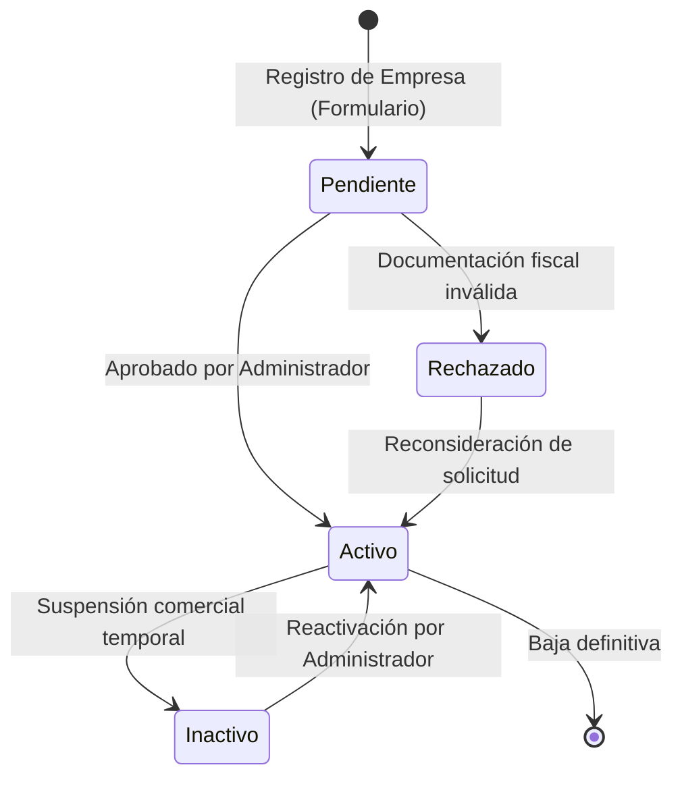
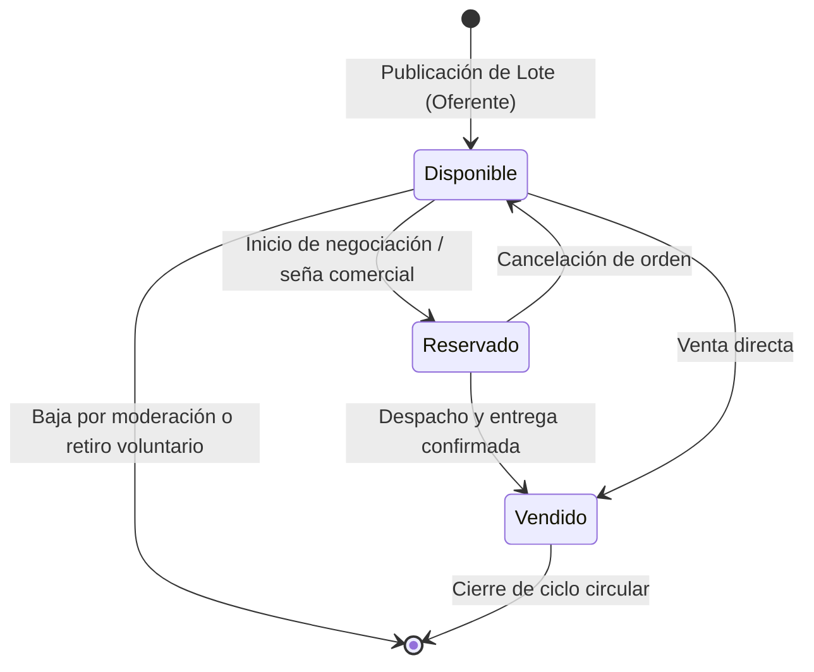
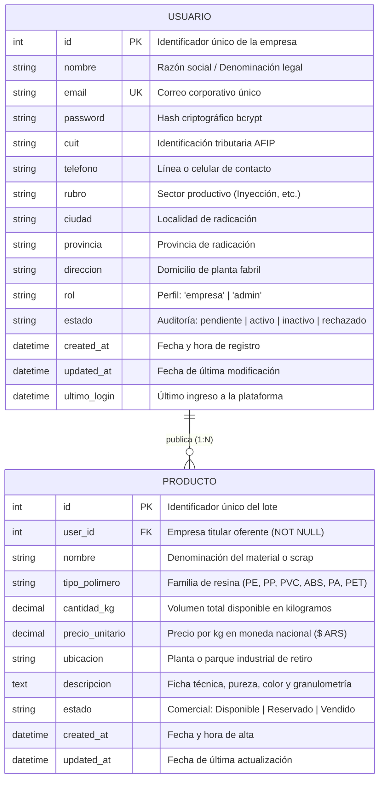

# Hito 1 — Diagrama Entidad-Relación (DER)
**Instituto Técnico Río Tercero — Curso 6° B**  
**Proyecto:** MateriaX — Red Industrial de Reutilización Circular  
**Espacios Curriculares:** Bases de Datos · Laboratorio de Aplicaciones II · Laboratorio de Programación  
**Docentes:** Vanesa Stucher · Francisco Rissone · Simón Zanetti  

---

## 1. Contexto del Negocio y Dominio del Sistema

**MateriaX** es una plataforma tecnológica corporativa concebida para impulsar la economía circular y la simbiosis industrial en la región centro del país. Su propósito es conectar industrias y plantas manufactureras para que puedan publicar, solicitar, valorizar y reincorporar excedentes, mermas limpias, descartes de producción y granzas de polímeros industriales (Polietileno PE, Polipropileno PP, PVC, ABS, Poliamida/Nylon PA, PET y equipamiento logístico reutilizable).

El diseño de la base de datos para el **Hito 1** responde a tres pilares fundamentales:
1. **Seguridad y Control Institucional:** Acceso exclusivo para plantas con personería jurídica validada ante AFIP (CUIT) y auditoría previa por parte del Administrador.
2. **Trazabilidad Técnica de Materiales:** Especificación unívoca del tipo de resina, peso en kilogramos, precio unitario de referencia, ubicación física de planta y características de pureza/molienda.
3. **Arquitectura Cero JavaScript:** Integridad de datos y validaciones procesadas íntegramente del lado del servidor (PHP 8 / CodeIgniter 4 / MySQL InnoDB).

---

## 2. Clasificación y Semántica Formal de las Entidades

El modelo conceptual del Hito 1 está integrado por dos entidades centrales:

```
┌─────────────────────────────────┐           (1,N)           ┌─────────────────────────────────┐
│             USUARIO             │ ◄───────────────────────► │            PRODUCTO             │
│      (Empresa Homologada)       │          PUBLICA          │       (Lote de Polímero)        │
└─────────────────────────────────┘                           └─────────────────────────────────┘
```

### A. Entidad Regular Fuerte: `USUARIO`
Representa a los actores comerciales e institucionales con credenciales de acceso al sistema. Comprende tanto a las empresas operativas (plantas industriales, transformadores plásticos, recicladores) como a los administradores generales de la plataforma.

* **Naturaleza:** Entidad regular (fuerte), ya que posee existencia propia e independiente en el dominio del problema.
* **Clave Primaria (PK):** `id` (numérico entero, autoincremental).
* **Clave Candidata / Alternativa (UK):** `email` (dirección corporativa única).

### B. Entidad Regular Débil por Existencia: `PRODUCTO`
Representa los lotes físicos de excedentes de materiales poliméricos publicados en la red para su intercambio comercial o retiro.

* **Naturaleza:** Entidad dependiente por existencia de la entidad `USUARIO`. Un lote no puede concebirse ni persistir en el catálogo sin una empresa titular responsable de su despacho y facturación.
* **Clave Primaria (PK):** `id` (numérico entero, autoincremental).
* **Clave Foránea (FK):** `user_id` (referencia al usuario que realiza la oferta).

---

## 3. Taxonomía Exhaustiva de Atributos

Siguiendo la teoría clásica de modelado conceptual de bases de datos:

### Tabla de Atributos: Entidad `USUARIO`

| Atributo | Tipo Conceptual | Clasificación | Dominio / Restricción | Propósito en el Negocio |
| :--- | :--- | :--- | :--- | :--- |
| **id** | Numérico Entero | Identificador (PK) | Entero positivo > 0 | Clave primaria unívoca. |
| **nombre** | Alfanumérico (100) | Simple, Obligatorio | No nulo, texto libre | Razón social o denominación legal. |
| **email** | Alfanumérico (150) | Simple, Único (UK) | Formato email válido, único | Credencial corporativa de acceso. |
| **password** | Alfanumérico (255) | Simple, Obligatorio | Hash bcrypt (60+ caracteres) | Almacenamiento seguro de clave. |
| **cuit** | Alfanumérico (20) | Simple, Obligatorio | Formato `30-XXXXXXXX-X` | Identificación fiscal tributaria ante AFIP. |
| **telefono** | Alfanumérico (30) | Simple, Obligatorio | Min 6 dígitos | Contacto telefónico de planta. |
| **rubro** | Alfanumérico (100) | Simple, Opcional | Inyección, Extrusión, Reciclado... | Clasificación del sector fabril. |
| **ciudad** | Alfanumérico (100) | Componente atómico | Localidad de radicación | Ubicación de la planta o sede. |
| **provincia** | Alfanumérico (100) | Componente atómico | Jurisdicción provincial | Ubicación geográfica provincial. |
| **direccion** | Alfanumérico (150) | Componente atómico | Calle, número, parque ind. | Domicilio legal o de planta fabril. |
| **rol** | Alfanumérico (50) | Simple, Obligatorio | `'empresa'`, `'admin'` | Perfil y nivel de autorización. |
| **estado** | Enum / Dominio | Simple, Obligatorio | `pendiente`, `activo`, `inactivo`, `rechazado` | Estado de homologación y auditoría fiscal. |
| **created_at** | Marca Temporal | Auditoría | Fecha y hora válida | Registro inicial de la solicitud. |
| **updated_at** | Marca Temporal | Auditoría | Fecha y hora válida | Última modificación de datos. |
| **ultimo_login**| Marca Temporal | Auditoría | Fecha y hora nula/válida | Registro de último acceso exitoso. |

> [!NOTE]
> **Atributo Compuesto descompuesto en Atómicos:** La dirección geográfica física se modela conceptualmente descompuesta en tres atributos atómicos independientes (`direccion`, `ciudad`, `provincia`), cumpliendo con la 1FN para permitir filtros eficientes por localidad y provincia.

---

### Tabla de Atributos: Entidad `PRODUCTO`

| Atributo | Tipo Conceptual | Clasificación | Dominio / Restricción | Propósito en el Negocio |
| :--- | :--- | :--- | :--- | :--- |
| **id** | Numérico Entero | Identificador (PK) | Entero positivo > 0 | Clave primaria del lote. |
| **user_id** | Numérico Entero | Foránea (FK) | Referencia a `USUARIO(id)` | Titularidad de la empresa oferente. |
| **nombre** | Alfanumérico (150) | Simple, Obligatorio | Min 3 caracteres | Denominación técnica del material. |
| **tipo_polimero** | Alfanumérico (50) | Simple, Obligatorio | `PE`, `PP`, `PVC`, `ABS`, `PA`, `PET` | Código de identificación de resinas (RIC). |
| **cantidad_kg** | Decimal (10,2) | Simple, Obligatorio | Valor numérico > 0 | Masa disponible pesada en báscula (kg). |
| **precio_unitario**| Decimal (10,2) | Simple, Obligatorio | Valor numérico >= 0 | Valor neto en pesos ($ ARS) por kg. |
| **ubicacion** | Alfanumérico (100) | Simple, Obligatorio | Planta o parque industrial | Lugar físico para el retiro de carga. |
| **descripcion** | Texto Largo | Simple, Opcional | Texto libre | Especificación técnica, MFI, color, empaque. |
| **estado** | Enum / Dominio | Simple, Obligatorio | `'Disponible'`, `'Reservado'`, `'Vendido'` | Estado de disponibilidad comercial. |
| **created_at** | Marca Temporal | Auditoría | Fecha y hora válida | Momento de publicación del lote. |
| **updated_at** | Marca Temporal | Auditoría | Fecha y hora válida | Última edición de ficha técnica o volumen. |

> [!TIP]
> **Atributo Derivado (Calculado):** El valor económico total del lote no se almacena para evitar redundancias de cálculo, sino que se obtiene dinámicamente mediante la fórmula:
> $$\text{Valor Total Lote} = \text{cantidad\_kg} \times \text{precio\_unitario}$$

---

## 4. Relación, Conectividad y Cardinalidad

### Vínculo: `PUBLICA` (Oferta Comercial de Excedentes)
Conecta a la entidad `USUARIO` con la entidad `PRODUCTO`.

* **Cardinalidad Mínima y Máxima:**
  * **`USUARIO` $\to$ `PRODUCTO`:** Cardinalidad **(0, N)**.  
    Una empresa que se registra puede no haber publicado ningún lote aún (mínimo 0), o bien puede publicar múltiples lotes de diferentes polímeros a lo largo del tiempo (máximo N).
  * **`PRODUCTO` $\to$ `USUARIO`:** Cardinalidad **(1, 1)**.  
    Todo lote de material existente en la plataforma pertenece de manera estricta y obligatoria a una y sólo una empresa oferente (mínimo 1, máximo 1). No se admiten publicaciones anónimas ni copropiedad de lotes en esta fase.

* **Tipo de Vínculo:** **1 a N** (Uno a Muchos).

* **Participación:**
  * `PRODUCTO`: **Participación Total** (todo producto está forzosamente asociado a un usuario).
  * `USUARIO`: **Participación Parcial** (pueden existir usuarios sin publicaciones activas).

* **Regla de Integridad Referencial:**
  * `ON DELETE CASCADE`: Si una empresa es dada de baja del sistema, sus lotes asociados se eliminan en cascada para evitar materiales huérfanos sin responsable legal.
  * `ON UPDATE CASCADE`: Si el identificador de la empresa se actualiza, la referencia en sus lotes se actualiza automáticamente.

---

## 5. Ciclos de Vida y Diagramas de Estados

### A. Ciclo de Vida del Usuario / Empresa

```mermaid
stateDiagram-v2
    [*] --> Pendiente : Registro de Empresa (Formulario)
    Pendiente --> Activo : Aprobado por Administrador
    Pendiente --> Rechazado : Documentación fiscal inválida
    Activo --> Inactivo : Suspensión comercial temporal
    Inactivo --> Activo : Reactivación por Administrador
    Rechazado --> Activo : Reconsideración de solicitud
    Activo --> [*] : Baja definitiva
```

### B. Ciclo de Vida del Producto / Lote de Material

```mermaid
stateDiagram-v2
    [*] --> Disponible : Publicación de Lote (Oferente)
    Disponible --> Reservado : Inicio de negociación / seña comercial
    Reservado --> Disponible : Cancelación de orden
    Reservado --> Vendido : Despacho y entrega confirmada
    Disponible --> Vendido : Venta directa
    Disponible --> [*] : Baja por moderación o retiro voluntario
    Vendido --> [*] : Cierre de ciclo circular
```

---

## 6. Diagrama Entidad-Relación Visual (Mermaid)

### Diagrama Conceptual y Lógico Completo


```mermaid
erDiagram
    USUARIO ||--o{ PRODUCTO : "publica (1:N)"

    USUARIO {
        int id PK "Identificador único de la empresa"
        string nombre "Razón social / Denominación legal"
        string email UK "Correo corporativo único"
        string password "Hash criptográfico bcrypt"
        string cuit "Identificación tributaria AFIP"
        string telefono "Línea o celular de contacto"
        string rubro "Sector productivo (Inyección, etc.)"
        string ciudad "Localidad de radicación"
        string provincia "Provincia de radicación"
        string direccion "Domicilio de planta fabril"
        string rol "Perfil: 'empresa' | 'admin'"
        string estado "Auditoría: pendiente | activo | inactivo | rechazado"
        datetime created_at "Fecha y hora de registro"
        datetime updated_at "Fecha de última modificación"
        datetime ultimo_login "Último ingreso a la plataforma"
    }

    PRODUCTO {
        int id PK "Identificador único del lote"
        int user_id FK "Empresa titular oferente (NOT NULL)"
        string nombre "Denominación del material o scrap"
        string tipo_polimero "Familia de resina (PE, PP, PVC, ABS, PA, PET)"
        decimal cantidad_kg "Volumen total disponible en kilogramos"
        decimal precio_unitario "Precio por kg en moneda nacional ($ ARS)"
        string ubicacion "Planta o parque industrial de retiro"
        text descripcion "Ficha técnica, pureza, color y granulometría"
        string estado "Comercial: Disponible | Reservado | Vendido"
        datetime created_at "Fecha y hora de alta"
        datetime updated_at "Fecha de última actualización"
    }
```

---

## 7. Diagrama Draw.io Oficial Multi-Pestaña

El archivo [`docs/DER_drawio.xml`](file:///c:/xampp/htdocs/MateriaxPro/docs/DER_drawio.xml) contiene **2 páginas completas** listas para visualizar y editar en [Draw.io / diagrams.net](https://app.diagrams.net):

1. **Pestaña 1: "1. DER (Entidad-Relación)"**: Diagrama Conceptual formal en notación Chen con entidades rectangulares (`USUARIO`, `PRODUCTO`), rombo de relación (`PUBLICA`), elipses de atributos, atributos identificadores subrayados y cardinalidades explícitas `(1,1)` y `(0,N)`.
2. **Pestaña 2: "2. Modelo Relacional (Tablas)"**: Diagrama Lógico/Físico de tablas relacionales con tipos de datos MariaDB/MySQL (`INT`, `VARCHAR`, `DECIMAL(10,2)`, `ENUM`), claves primarias (`PK`), foráneas (`FK`), índices de optimización y conectores relacionales pata de gallo (*Crow's Foot* `1:N`) con regla `ON DELETE CASCADE`.

### Instrucciones para Visualización en Draw.io:
1. Abrir https://app.diagrams.net en cualquier navegador web.
2. Seleccionar **Archivo > Abrir desde > Dispositivo**.
3. Cargar el archivo local `docs/DER_drawio.xml`.
4. En la barra inferior, alternar entre las pestañas **1. DER** y **2. Modelo Relacional**.
